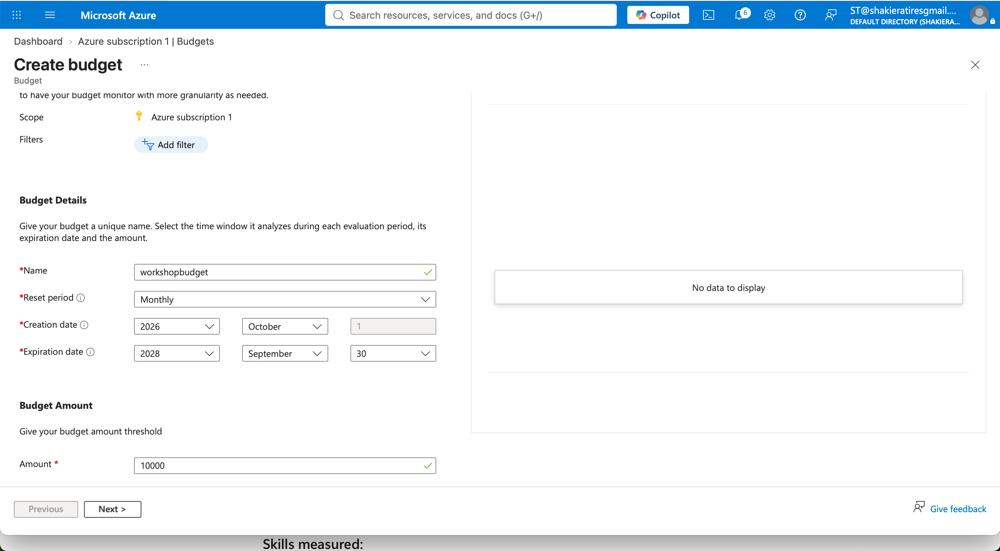
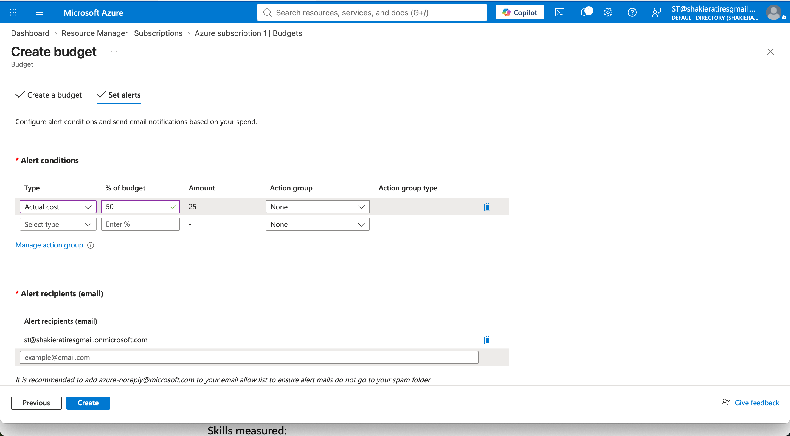
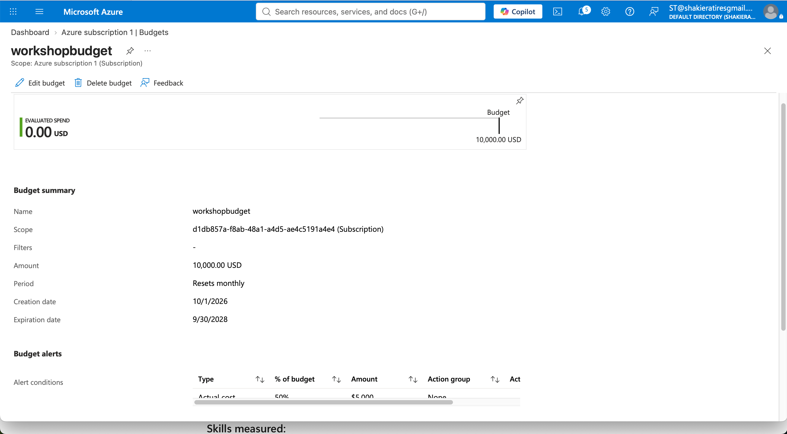

# Azure Cost Management, Budgets & Alerts Lab

## 🎯 Objective
Configured enterprise cloud financial governance controls by establishing a subscription-level budget ($10,000.00 USD), defining automated 50% threshold spending alerts ($5,000.00), and verifying deployment metrics to proactively monitor scale-tier expenditures.

## 🛠️ Tech Stack & Concepts
* **Cloud Platform:** Microsoft Azure
* **Cost Management:** Cost Analysis, Subscription-Level Budgets ($10,000.00 USD Monthly)
* **Governance & Alerts:** Actual Cost Threshold Triggers (50% / $5,000.00 USD), Automated Email Notifications

---

## 📋 Implementation Walkthrough & Screenshots

### 1. Budget Creation & Financial Parameters
Configured a monthly recurring budget (`workshopbudget`) scoped at the subscription level with a $10,000.00 USD threshold, tracking active spend over a designated enterprise lifecycle period.
* **Configuring Budget Details & Threshold Amount:**

### 2. Alert Conditions & Notification Setup
Established automated alerting rules tied to actual spend conditions (triggering at 50% / $5,000.00 USD of the total budget) and designated target email recipients for proactive financial risk monitoring.
* **Setting Alert Conditions & Email Recipients:**

### 3. Deployment Verification & Monitoring Summary
Verified the completed enterprise budget deployment within the Azure Portal, reviewing summary parameters, expiration timelines, and active alert criteria.
* **Budget Summary & Deployment Overview:**

---

## 🚀 Key Takeaways
* Successfully implemented scalable cost-control boundaries and budget tracking mechanisms in Azure to prevent unexpected resource expenditures across enterprise workloads.
* Configured automated alert thresholds to ensure proactive notification before reaching high-tier financial limits.